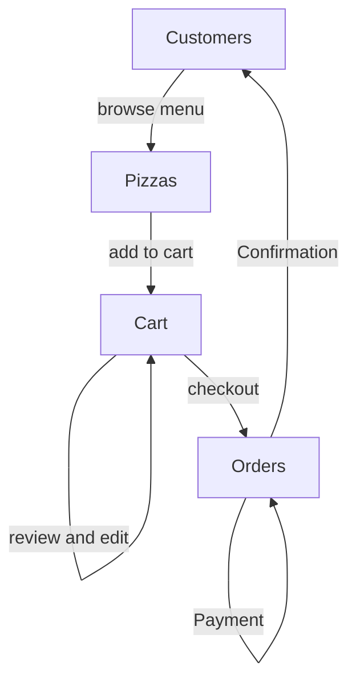

# pizza-planet-modern-monolith

Pizza Planet Modern Monolith Application 🍕 🛻

## High level design

## DB Diagram of Pizzas Planet

## Tech Stack

- [ASP.NET](https://dotnet.microsoft.com/en-us/apps/aspnet)
- [FluentValidation](https://docs.fluentvalidation.net/en/latest/index.html)
- [BCrypt - for encrypting passwords at rest](https://www.nuget.org/packages/BCrypt.Net-Next)
- [MongoDB](https://www.mongodb.com/)
- [JWT customer token generation](https://jwt.io/)

## User Flow

- Customers start by browsing the menu of pizzas available through the API. 
- They can filter or search for specific pizzas, and view details about each one.
- Once the customer has decided on the pizzas they want to order, they add them to their cart. 
- The cart is connected to their account, so they can save it for later or come back to it.
- Next, the customer reviews the items in their cart and can make changes if needed. Once they're satisfied, they proceed to checkout.
- During checkout, the customer make the payment, the order get confirm and they receive the confirmation

