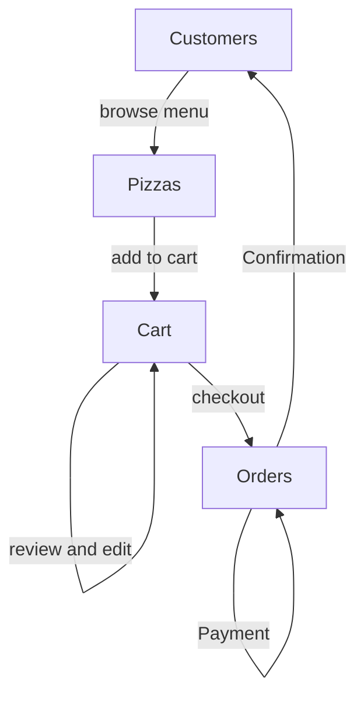
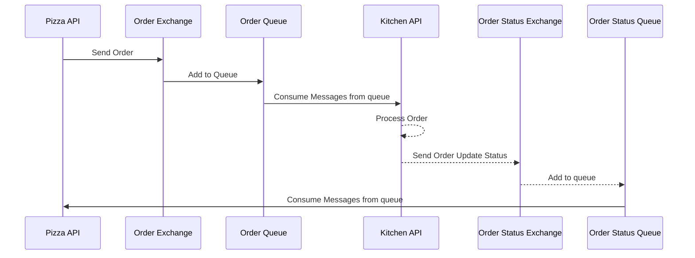

# pizza-planet-modern-monolith

Pizza Planet Modern Monolith Application 🍕 🛻

## High level design

## DB Diagram of Pizzas Planet

## DB Diagram of Pizza Planet Kitchen

## Tech Stack

- [ASP.NET](https://dotnet.microsoft.com/en-us/apps/aspnet)
- [FluentValidation](https://docs.fluentvalidation.net/en/latest/index.html)
- [BCrypt - for encrypting passwords at rest](https://www.nuget.org/packages/BCrypt.Net-Next)
- [Repository pattern](https://www.martinfowler.com/eaaCatalog/repository.html)
- [MassTransit](https://masstransit-project.com/)
- [RabbitMQ](https://www.rabbitmq.com/)
- [JWT customer token generation](https://jwt.io/)
- [Pulumi Infrastructure Automation](https://www.pulumi.com/)
- [JWT customer token generation](https://jwt.io/)
- [PostgreSQL](https://www.postgresql.org/)

## User Flow

- Customers start by browsing the menu of pizzas available through the API. 
- They can filter or search for specific pizzas, and view details about each one.
- Once the customer has decided on the pizzas they want to order, they add them to their cart. 
- The cart is connected to their account, so they can save it for later or come back to it.
- Next, the customer reviews the items in their cart and can make changes if needed. Once they're satisfied, they proceed to checkout.
- During checkout, the customer make the payment, the order get confirm and they receive the confirmation

## Message Queue
In our API app, we streamline the ordering process by sending orders directly to the backend kitchen for processing. This is achieved by routing orders through an exchange, then being added to a queue for the kitchen to efficiently handle. Here are some reasons why I did want to use an intermediary exchange in RabbitMQ:

- Increased complexity: Adding an intermediary exchange increases the complexity of your messaging architecture, making it harder to understand and troubleshoot.

- Reduced performance: Intermediary exchanges add an additional hop for messages to pass through, which can slow down the overall performance of your system.

- Increased risk: Intermediary exchanges can act as a single point of failure, meaning that if they go down, your entire messaging system may be affected.

- Limited scalability: Intermediary exchanges can become a bottleneck if you have a high volume of messages passing through them, limiting the scalability of your system.

- Extra cost: Intermediary exchanges can add extra cost to your messaging infrastructure, as they require additional resources to operate

Our MQ flows would look something like the following.

This flowchart describes a process for ordering and preparing a pizza using our APIs.

1. The Pizza API sends an order to the Order Exchange.
2. The Order Exchange adds the order to the Order Queue.
3. The Kitchen API consumes messages from the Order Queue, and processes the order.
4. The Kitchen API sends an update on the order's status to the Order Status Exchange.
5. The Order Status Exchange adds the status update to the Order Status Queue
6. The Pizza API consumes messages from the Order Status Queue to update the order status for the customer.

